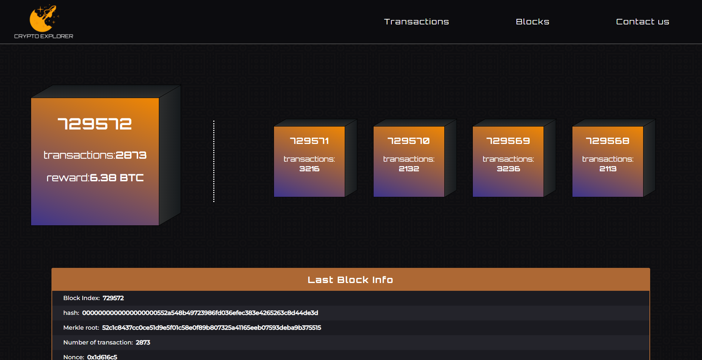
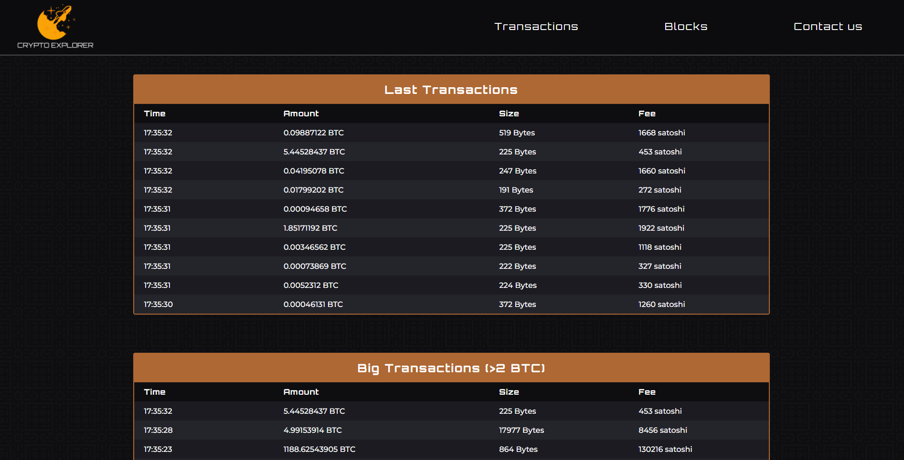

# About the project

**Bitcoin blockchain explorer** is a tool for viewing blocks on the bitcoin network. The project uses open API from this [webpage](https://www.blockchain.com/api)

✨**React.js**✨

#

